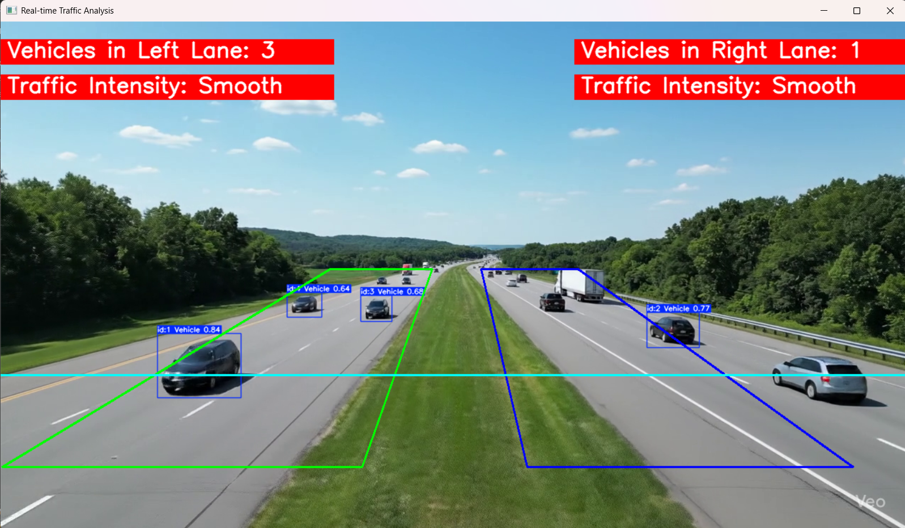

# 🚦 NextGen Traffic Insights  

### Author: Kesavaraja M 

NextGen Traffic Insights is an AI-powered real-time traffic analysis system that uses a fine-tuned **YOLOv8 model** along with **ByteTrack** to detect and count vehicles accurately from live video feeds. The system also classifies **lane-wise traffic flow** as *Smooth* or *Heavy*, while generating a detailed final traffic analysis report.  

---

## ✨ Features  
- ✅ Vehicle detection using **YOLOv8**  
- ✅ Multi-object tracking with **ByteTrack**  
- ✅ Lane-wise vehicle counting & intensity classification  
- ✅ Real-time annotated video output with vehicle IDs and lane counts  
- ✅ Final report including:  
  - Total unique vehicles  
  - Maximum vehicles in a frame  
  - Overall traffic condition (Smooth/Heavy)  
  - Average inference speed & FPS  

---

## 📂 Project Structure  
NextGen-Traffic-Insights/

- Smart-Traffic-Analyzer/
- real_time_traffic_analysis.py # Main script
- yolov8s.pt # YOLOv8 pretrained model
- output.avi # Saved annotated video
- requirements.txt # Dependencies
- README.md # Project documentation

---

## ⚙️ Installation  

1. Clone the repo:  
   ```bash
   git clone https://github.com/<your-username>/NextGen-Traffic-Insights.git
   cd NextGen-Traffic-Insights/Smart-Traffic-Analyzer

2. Create a virtual environment & install dependencies:
   python -m venv env
   env\Scripts\activate   # On Windows
   pip install -r requirements.txt

## ▶️ Usage

    Run the real-time traffic analysis:
    python real_time_traffic_analysis.py
    
-  A video window will open showing real-time detections.
-  Vehicles will be tracked with unique IDs.
-  Lane-wise vehicle counts will appear on screen.
-  A Final Traffic Analysis Report will be printed in the terminal.
-  Annotated video will be saved as output.avi.
  
## 🖼️ How It Works

   Below is an example of how vehicles are detected and tracked in real-time:
    
   

 ---
 
## 📊 Example Final Report:
  
-   Total Unique Vehicles Detected: 52
-  Maximum Vehicles in a Frame: 7
-  Overall Traffic Condition: Heavy
-  Average Inference Speed: 115.4 ms/frame (≈ 8.7 FPS)

---

## 🔮 Future Enhancements

  Multi-camera integration for larger intersections
  
  Advanced traffic flow classification (Low / Medium / High)
  
  Dashboard for real-time traffic monitoring

---

## 🧑‍💻 Author

Kesavaraja M

Computer Science Engineering (AI & ML)

Tiruchirappalli

   
